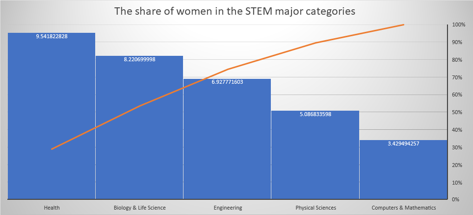
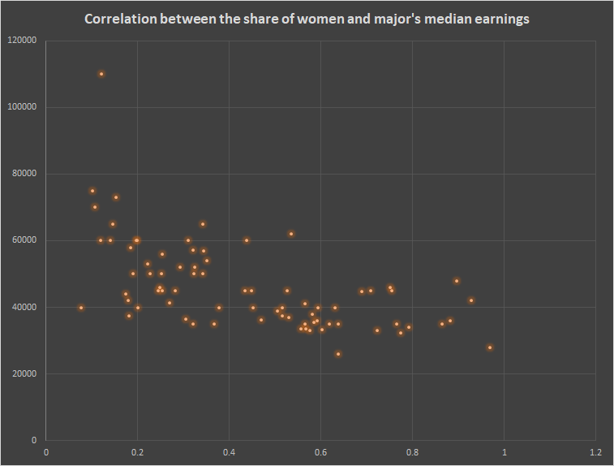
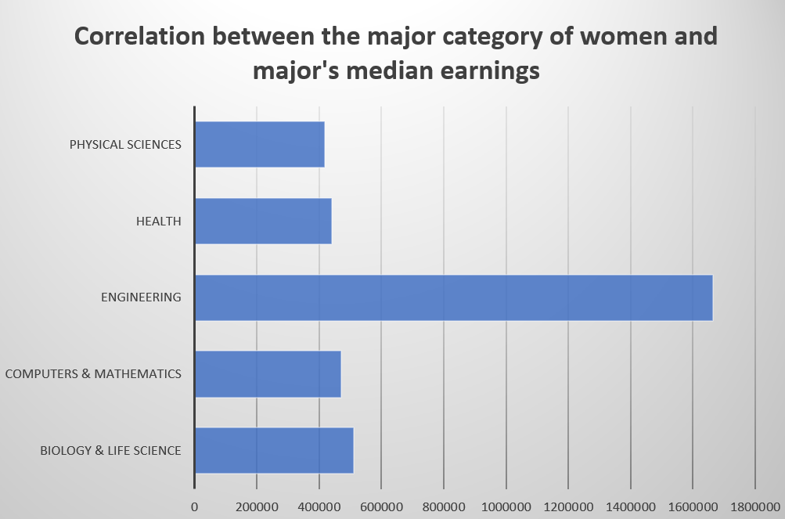
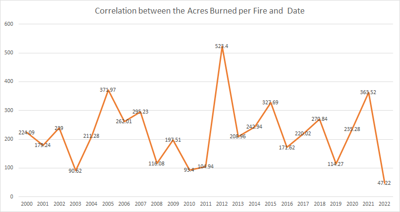

```{r setup, include=FALSE}
knitr::opts_chunk$set(echo = TRUE)
```
# Arrange Tables In-Class Exercises

The goal of this exercise is to gain experience thinking about data types and proposing chart idioms appropriate for that data.
 
## Questions

**Q1.**

Compare the share of women in the STEM major categories (Biology & Life Science, Computing & Mathematics, Engineering, Health, Physical Sciences).

**Answer**

For the median share of women in each STEM major categories, there is 9.5% of women in Health area, 8.2% in Biology & Life Science, 6.9% in Engineering, 

5.1% in Physical Sciences, 3.4% in Computers 7 Mathmatics.


Here attahced is the bar plot, I map Median share of women in each STEM major categories into y axis, map each STEM major into x axis, an accumulation line plot also attached inthe plot.

I kind of questions, why women sharing less in Computer Science, there is no IQ difference between man and women.





**Q2.**

Is there a correlation between the share of women in a STEM major and that major's median earnings?  Are there outliers from the norm? 

Related: How does the major category play into this relationship?  What about the total number of students in that major?


**Answer**

  The higher the share of women in a STEM major seems the lower median earnings they have.

  There is on outliers from the norm in the Engineering area, with the meadian earnings is 110K per year they have.
  
  Below attached is the share of women in major STEM categories and the major's earnings. I use scart plot for this questions. I map the share of women in x axis, map the median earning in to y axis.




  The major category do plays into this correlation. The women in Engineering have the most earnings, while the physical sciences share the least.
  
  The total number of students in Engineering is 537583 in this analysis data, 129276 women in there and only counts 43.69% of it.





**Q3.**

What is the trend in the number of acres burned per fire during the month of August in the US between 2000-2021? 

**Answer**


There seems no trend in the number of acres burned per fire during the month of August in the US between 2000 - 2021. Or there trend of these two seem meets into equilium, no increaing trend and no decreasing trend either.




